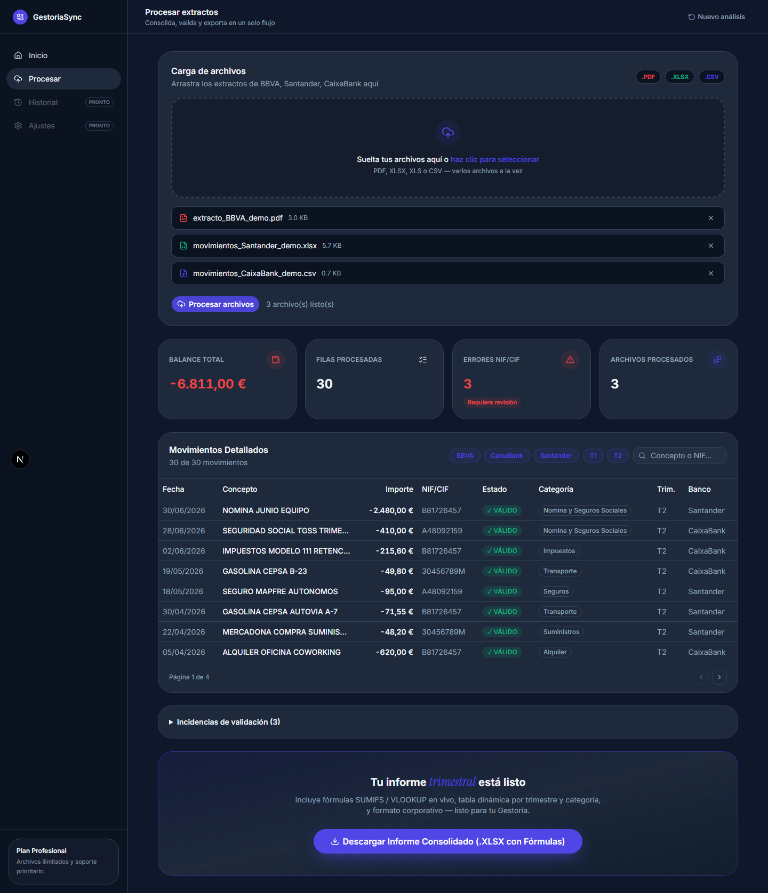
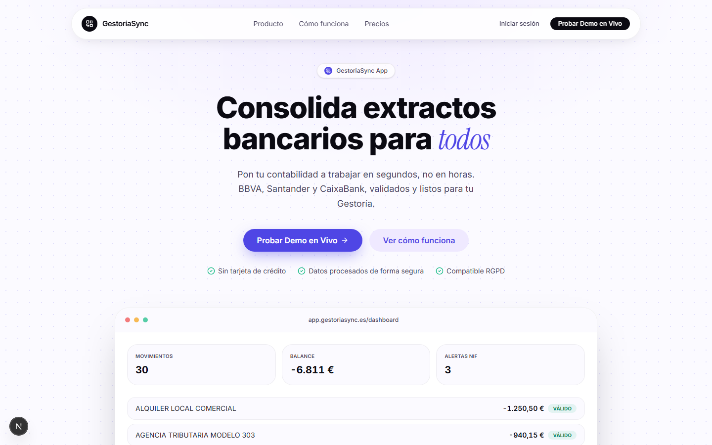

# GestoriaSync

**Consolidate bank statements and invoices for Spanish accounting firms (Gestorías) — in seconds, not hours.**

**Live demo:** [gestoriasync.vercel.app](https://gestoriasync.vercel.app) · [gestoriasync.vercel.app/dashboard](https://gestoriasync.vercel.app/dashboard) — try it with the sample files in [`demo_files/`](demo_files/), no signup required.
API deployed at [gestoriasync-api.onrender.com](https://gestoriasync-api.onrender.com) (interactive docs at [`/docs`](https://gestoriasync-api.onrender.com/docs); free-tier instance spins down after inactivity, first request can take ~30s to wake up).

GestoriaSync ingests bank statements from multiple Spanish banks (BBVA, Santander, CaixaBank) in mixed formats (PDF, XLSX, CSV), auto-detects each file's shape even when column names differ, normalizes dates and European-format currency, validates every Spanish tax ID (DNI/NIE/CIF) against the official checksum algorithm, categorizes each expense, and exports a single Excel report with **live formulas** (`SUMIFS`, `VLOOKUP`) instead of static values.



## Why

Closing a quarter manually means opening every bank export, renaming columns by hand, copy-pasting into one sheet, and hoping no NIF/CIF has a typo Hacienda will reject. GestoriaSync turns that into: drop the files, click once, download a client-ready workbook.

## Features

- **Multi-bank auto-detection** — BBVA, Santander, CaixaBank signatures, plus a fuzzy-matching fallback parser for any spreadsheet whose columns don't match a known bank (`Concepto` vs `Descripción` vs `Detalle del movimiento`, etc.)
- **Multi-format ingestion** — PDF (table extraction via `pdfplumber`), XLSX, CSV, with automatic header-row detection (banks prepend account-summary rows before the real table)
- **Spanish normalization** — `DD/MM/YYYY` dates, `1.234,56 €` currency parsing in both directions
- **NIF/NIE/CIF validation** — full check-digit algorithm per Agencia Tributaria rules, not just a regex
- **Automatic expense categorization** — Alquiler, Suministros, Impuestos, Nómina, etc., via transparent keyword rules (auditable, not a black box)
- **Excel export with live formulas** — `SUMIFS`/`VLOOKUP`-driven quarterly pivot, a NIF/CIF lookup tool, and conditional formatting, generated with `openpyxl`
- **REST API** cleanly separated from the UI — parse and export are two stateless endpoints
- **Marketing landing page + working dashboard**, both in the same Next.js app

## Screenshots

| Landing | Dashboard |
|---|---|
|  |  |

## Tech stack

**Backend** — Python 3.12+, FastAPI, Pydantic v2, pandas, openpyxl, pdfplumber, rapidfuzz
**Frontend** — Next.js 15 (App Router), React 19, TypeScript, Tailwind CSS v4, shadcn/ui
**Deployment** — frontend on Vercel, backend on Render, both auto-deploying from `main`

## Architecture

```
core/                       # pure Python domain logic — no web framework in sight
├── parsers/
│   ├── base.py             # shared engine: fuzzy column mapping, header-row detection
│   ├── bbva.py              santander.py, caixabank.py, generic.py   # per-bank detectors
│   ├── pdf_extract.py      # pdfplumber table extraction
│   └── detector.py         # entry point: bytes + filename -> ParsedStatement
├── normalizers/
│   ├── dates.py             currency.py, identifiers.py (NIF/NIE/CIF checksum)
├── categorizer.py          # keyword-based expense classification
├── excel_builder.py        # openpyxl report with live formulas
└── models.py                # Pydantic v2 schemas (Movement, ParseIssue)

main.py                     # FastAPI app — thin HTTP adapter over core/
├── POST /api/parse         # multipart file upload -> movements + summary + issues (JSON)
└── POST /api/export        # JSON movements -> .xlsx (StreamingResponse)

frontend/                   # Next.js 15 app
├── app/page.tsx            # marketing landing page
├── app/dashboard/page.tsx  # upload -> process -> review -> export flow
├── components/landing/     # Hero, Features, Pricing, Footer...
├── components/dashboard/   # Sidebar, UploadZone, KpiCards, MovementsTable
└── lib/api.ts               lib/types.ts   # typed fetch wrappers over the REST API

demo_files/                 # generated sample statements (see generate_demo_data.py)
scripts/smoke_test.py       # runs the full pipeline against demo_files without the API
```

The `core/` package has no dependency on FastAPI or any web framework — it's a plain Python library that `main.py` wraps in two endpoints. That boundary is deliberate: the parsing/validation/Excel-generation logic is independently testable and reusable (e.g. from a CLI or a batch job) without touching the API layer.

## Getting started

Running locally isn't required to try it — see the live demo above. These steps are for running your own copy.

### Backend

```bash
python -m venv venv
venv\Scripts\activate          # Windows; use `source venv/bin/activate` on macOS/Linux
pip install -r requirements.txt
uvicorn main:app --reload --port 8000
```

The API is now at `http://localhost:8000` (interactive docs at `/docs`).

### Frontend

```bash
cd frontend
npm install
cp .env.local.example .env.local   # points NEXT_PUBLIC_API_URL at the backend
npm run dev
```

The app is now at `http://localhost:3000` (Next.js picks the next free port, e.g. `3001`, if 3000 is taken) — landing page at `/`, working dashboard at `/dashboard`.

### Try it with sample data

`demo_files/` ships with realistic BBVA/Santander/CaixaBank/generic sample statements (Spanish dates, comma-decimal amounts, a mix of valid and deliberately invalid NIF/CIF). Drop them into the dashboard's upload zone to see the full flow, or regenerate them:

```bash
python demo_files/generate_demo_data.py
```

To sanity-check the pipeline without the API or UI:

```bash
python scripts/smoke_test.py
```

## API reference

| Endpoint | Method | Body | Returns |
|---|---|---|---|
| `/api/parse` | POST | `multipart/form-data` — one or more files | JSON: `{ summary, movements[], issues[] }` |
| `/api/export` | POST | JSON — `{ movements[], issues[] }` (as returned by `/api/parse`) | `.xlsx` file with live formulas |
| `/api/health` | GET | — | `{ "status": "ok" }` |

## License

MIT — see [LICENSE](LICENSE).
